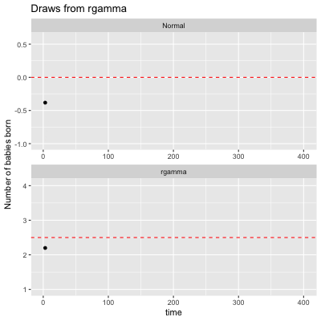

 <!-- badges: start -->
  [](https://github.com/misikoff/TailRiskAnalyzer/actions/workflows/R-CMD-check.yaml)
  <!-- badges: end -->

# TailRiskAnalyzer

# Installation

```r
devtools::install_github("misikoff/TailRiskAnalyzer")
```


<!-- embed output.gif from R directory -->
<!--  -->
