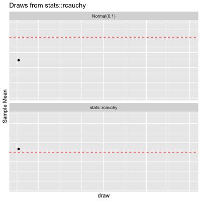

<!-- README.md is generated from README.Rmd. Please edit that file -->
<!-- badges: start -->

[](https://github.com/misikoff/TailRiskAnalyzer/actions/workflows/R-CMD-check.yaml)
<!-- badges: end -->

# TailRiskAnalyzer

# Installation

``` r
devtools::install_github("misikoff/TailRiskAnalyzer")
```

``` r
library(TailRiskAnalyzer)

draw_lln_with_func_facet(
  animate = TRUE, n = 200,
  theoretical_mean = 2.5, stats::rcauchy, location = 2.5, scale = 2
)
#> `geom_line()`: Each group consists of only one observation.
#> ℹ Do you need to adjust the group aesthetic?
#> `geom_line()`: Each group consists of only one observation.
#> ℹ Do you need to adjust the group aesthetic?
#> `geom_line()`: Each group consists of only one observation.
#> ℹ Do you need to adjust the group aesthetic?
#> `geom_line()`: Each group consists of only one observation.
#> ℹ Do you need to adjust the group aesthetic?
```

<!-- -->
